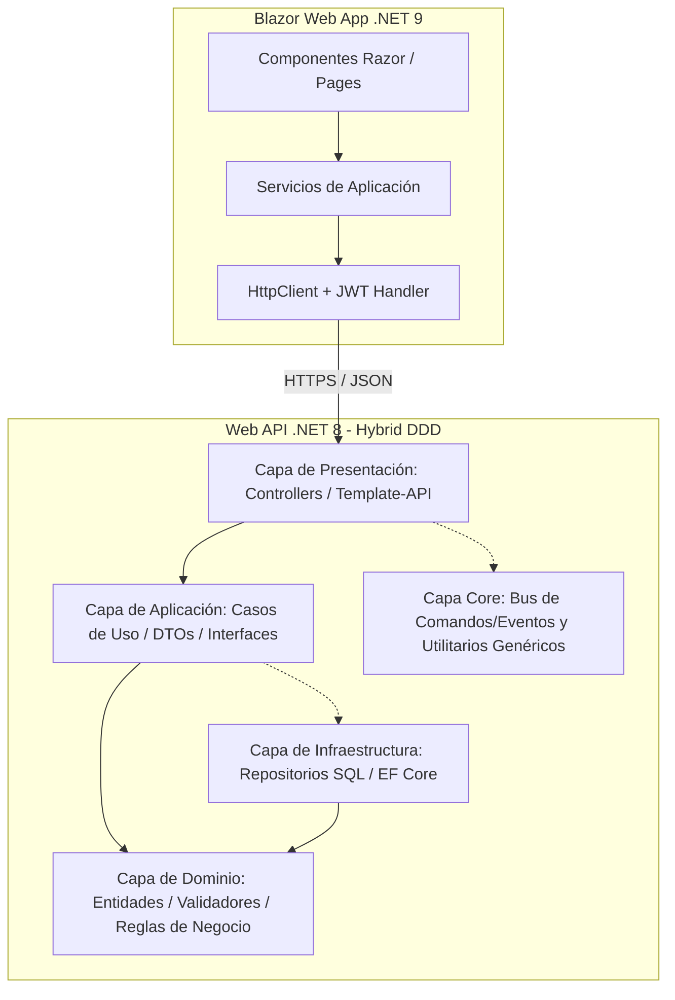

# Tesis en Veterinaria Ñandubay - Sistema de Gestión Veterinaria

Este repositorio contiene el sistema de gestión veterinaria **Ñandubay**. El proyecto está estructurado con un Backend en formato Web API y un Frontend interactivo desarrollado en Blazor. Está diseñado para ser lo más ligera posible, utilizando una base de datos ligera SQLite, y delegando las tareas de renderizado pesadas al servidor. 

---

## Tecnologías y Frameworks

### Backend
* **Runtime & Lenguaje:** .NET 8.0 (C#)
* **Framework Web:** ASP.NET Core Web API
* **ORM / Acceso a Datos:** Entity Framework Core (EF Core)
* **Base de Datos:** SQLite (archivo local `VeterinariaDB.sqlite` en el directorio de la API)
* **Seguridad y Autenticación:** JWT Bearer Tokens (Claims personalizados para Roles y Sucursal asignada)
* **Documentación de API:** Swagger / OpenAPI
* **Validación:** FluentValidation integrado en el dominio de las entidades

### Frontend
* **Runtime & Lenguaje:** .NET 9.0 (C#)
* **Framework UI:** Blazor Web App (Interactive Server Render Mode)
* **Estilos:** Bootstrap & CSS Personalizado (soporte para dark/light themes y diseño responsivo)
* **Manejo de Estado Local:** Blazored.LocalStorage (persistencia del token JWT y sesión)
* **Integraciones:** Generador de enlaces dinámicos para Google Calendar, WhatsApp Web (con plantillas inteligentes) e Email (mailto).

---

## Arquitectura del Sistema

El sistema implementa una **Arquitectura Híbrida DDD (Domain-Driven Design)** orientada a la separación de responsabilidades y el aislamiento del dominio de negocio.



### Descripción de Capas del Backend
1. **Domain:** Contiene las entidades principales de negocio (e.g., `Paciente`, `Propietario`, `Turno`, `Sucursal`), objetos de valor y sus respectivos validadores de dominio. Es agnóstico a la infraestructura y bases de datos.
2. **Application:** Define los contratos (interfaces de repositorios), los objetos de transferencia de datos (DTOs) y contiene la lógica de los casos de uso.
3. **Infrastructure:** Contiene las implementaciones de bases de datos utilizando EF Core y SQLite, repositorios de stock, usuarios, veterinarios, y el mapeo correspondiente del modelo relacional.
4. **Template-API (Presentación):** Expone los controladores REST que manejan las solicitudes HTTP, aplica las políticas de autenticación y autorización JWT, y define la configuración base del servidor.
5. **Core (Proyectos Core.*):** Clases base genéricas reutilizables para el mapeo de objetos, adaptadores de red, bus de mensajería (RabbitMQ) y controladores genéricos.

---

## Características Clave

### 1. Control Multi-Sucursal (Multi-Branch Isolation)
* Soporte para múltiples sucursales a nivel de dominio (`Sucursal.cs`).
* Los usuarios no administradores (Veterinarios, Recepcionistas, Gerentes) ven su información restringida a la sucursal a la que pertenecen mediante el claim `sucursalId` inyectado en su token de autenticación.
* Los Administradores (`Admin`) tienen visibilidad total inter-sucursal y la capacidad de gestionar las sucursales del sistema.

### 2. Agenda y Centro de Turnos Optimizado
* Gestión de citas de mascotas directamente desde un calendario unificado.
* Ventanas de edición e inserción in-place sin necesidad de redirigir de página.
* Panel rápido para visualizar datos del paciente y el propietario.
* Integración para contactar directamente por WhatsApp/Email al dueño y añadir recordatorios dinámicos con indicaciones de ayuno quirúrgico en caso de cirugías.

### 3. Centro de Resoluciones y Dashboard Analítico
* Acceso a métricas globales de la veterinaria.
* Deep-linking en alertas para dirigirse de forma directa a la sección afectada en un solo clic (ej. vacunas faltantes, bajo stock de productos, etc.).

---

## Instrucciones para Buildear e Iniciar Localmente

### Requisitos Previos
* SDK de .NET 8.0 y SDK de .NET 9.0 instalados en tu sistema.
* Puerto `7204` (HTTPS) y `5139` (HTTP) libres para la API de Backend.
* Puerto `5062` o puerto de desarrollo por defecto libre para el Frontend de Blazor.

---

### Paso 1: Configurar y Ejecutar el Backend

1. Dirígete a la carpeta del Backend:
   ```bash
   cd Backend
   ```
2. Restaura las dependencias de NuGet de la solución:
   ```bash
   dotnet restore HybridDDDArchitecture.sln
   ```
3. Compila los proyectos:
   ```bash
   dotnet build HybridDDDArchitecture.sln
   ```
4. Ejecuta el proyecto API (`Template-API`):
   ```bash
   dotnet run --project Template-API/Template-API.csproj
   ```
5. Una vez iniciado, puedes explorar y probar la documentación de la API en:
   * **Swagger UI:** `https://localhost:7204/swagger`

*Nota: El archivo de base de datos SQLite `VeterinariaDB.sqlite` ya se encuentra inicializado y pre-cargado con datos semilla en el directorio del Backend.*

---

### Paso 2: Configurar y Ejecutar el Frontend

1. Dirígete a la carpeta del Frontend:
   ```bash
   cd Frontend/BlazorFrontEnd
   ```
2. Restaura las dependencias del proyecto:
   ```bash
   dotnet restore BlazorFrontEnd.csproj
   ```
3. Compila el proyecto:
   ```bash
   dotnet build BlazorFrontEnd.csproj
   ```
4. Ejecuta la aplicación de Blazor:
   ```bash
   dotnet run
   ```
5. Accede a la interfaz de Ñandubay mediante tu navegador en la URL indicada por la terminal (generalmente `https://localhost:5062` o la URL configurada en tu `launchSettings.json`).

---

## Credenciales de Prueba por Defecto
El sistema cuenta con cuentas semilla para pruebas (las contraseñas se encuentran encriptadas y mapeadas a la base de datos SQLite local): 

* **Administrador (Admin):**
  * **user:** `admin`
  * **pass:** `Admin123!`
* **Gerente:**
  * **user:** `gerente1 y gerente2`
  * **pass:** `Gerente123!`
* **Veterinario:**
  * **user:** `vet1, vet2, y vet3`
  * **pass:** `Vet123!`
* **Recepcionista:**
  * **user:** `recep1 y recep2`
  * **pass:** `Recep123!`
